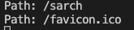

# Lab Report 2

## Part 1
The code for the Simplest Search Engine is below:

In the file SearchEngine.java the code was

```java
import java.io.IOException;
import java.net.URI;
import java.util.ArrayList;

class Handler implements URLHandler {
    // The one bit of state on the server: a number that will be manipulated by
    // various requests.
    ArrayList<String> strings = new ArrayList<>();

    public String handleRequest(URI url) {
        if (url.getPath().equals("/")) {
            return String.format("Add a string!");
        } else if (url.getPath().equals("/add")) {
            String[] parameters = url.getQuery().split("=");
            if(parameters[0].equals("s"))
            {
                strings.add(parameters[1]);
                return String.format("You added " + parameters[1]);
            }
        } else {
            String returnString = "";
            System.out.println("Path: " + url.getPath());
            if (url.getPath().contains("/search")) {
                String[] parameters = url.getQuery().split("=");
                if (parameters[0].equals("s")) {
                    String stringToLookFor = parameters[1];
                    for(String s : strings){
                        if(s.contains(stringToLookFor)){
                            returnString += s;
                            returnString += "\n";
                        }
                    }

                    return String.format(returnString);
                }
            }
        }

        return "404 Not Found";
    }
}

class SearchEngine {
    public static void main(String[] args) throws IOException {
        if(args.length == 0){
            System.out.println("Missing port number! Try any number between 1024 to 49151");
            return;
        }

        int port = Integer.parseInt(args[0]);

        Server.start(port, new Handler());
    }
}
```
When you first start the server with a port number of your choice (4000 in this case), the load up or default screen is the screenshot below.


This is a list of of strings and you can add or search for Strings! Below is a screenshot of adding strings.


When you append `/add?s=pineapple` to the intial link of `localhost:4000`, the method of the second if statement below is called.
```java
else if (url.getPath().equals("/add")) {
            String[] parameters = url.getQuery().split("=");
            if(parameters[0].equals("s"))
            {
                strings.add(parameters[1]);
                return String.format("You added " + parameters[1]);
            }
        }
```

Since `url.getPath()` equals our `/add` this if statement is called. Then, the method will split the query where the equal sign is and place the two values into a String array. After `/add`, we are left with `?s=pineapple`. The query knows it starts at `?` and it will split the string at `=`, making the first element in the String array `s` and the second element in the String array `pineapple`. Then the program will make sure that the first String array element is `s`, then add the actual string (the one in the second element), `pineapple` into the ArrayList in the code. It will then print what was added. Every part of the path is relevant and missing a `/`, `?`, or `/add` provide an "404 Not Found" error instead. The only value that would change when trying to add a string is the string you want to add. As long as you start the whole path with `localhost:(your port number)/add?s=(your String)`, the request will process each one individually. 

We can add another string "apple".


I will also add the string "orange", but there won't be a screenshot for it. Now the ArrayList includes the strings ["pineapple", "apple", "orange"].

Say we want to search and see which strings that we added have the string "app" inside them. This would be from the custom search method we created (also an if statement). See the code below:

```java
else {
  String returnString = "";
  System.out.println("Path: " + url.getPath());
  if (url.getPath().contains("/search")) {
      String[] parameters = url.getQuery().split("=");
      if (parameters[0].equals("s")) {
          String stringToLookFor = parameters[1];
          for(String s : strings){
              if(s.contains(stringToLookFor)){
                  returnString += s;
                  returnString += "\n";
              }
          }
          return String.format(returnString);
      }
  }
}
```

In this case, if `url.getPath()` finds `\search` next, it will execute the if block where similar to the last code block, `url.getQuery()` will find the `?`, and then split everything from the equal sign into a String array. The first element of the String array will be "s", and the second element will be the string we entered which is "app". If the first element is "s", then the program will loop through the array list, and use the `.contains()` method on each string to find if the strings we added contain the string "app" in them. It will add these strings to a "returnString" and then display which strings have the string "app" in them. Below is a screenshot of what the URL and output looks like. If we change the string after `s=`, then it will simply rerun the code to find strings that match it. If none of the strings include the strings we are looking for, the page will turn white. It may be helpful here to add an error message if none of the strings include the string we are looking for.


An additional screenshot of what happens below if you enter an URL that the program doesn't recognize. You will see "404 Not Found" on the screen and the console will display the path that was entered. Below is an example, where we spell search wrong.




## Part 2

### ArrayExamples - reversed()

The failure-inducing input for ArrayExamples, the reversed() test, is below. The input array was {1, 2, 3, 4, 5} and the output array should have been {5, 4, 3, 2, 1}.

```java
static int[] reversed(int[] arr) {
  int[] newArray = new int[arr.length];
  for(int i = 0; i < arr.length; i += 1) {
    arr[i] = newArray[arr.length - i - 1];
  }
  return arr;
}
```
The symptom was the output in the console below.


The code without the bug looks like this:

```java
static int[] reversed(int[] arr) {
  int[] newArray = new int[arr.length];
  for(int i = 0; i < arr.length; i += 1) {
    newArray[i] = arr[arr.length - i - 1];
  }
  return newArray;
}
```

What's happening here is before, the program had created a "newArray" which was empty. The for loop then was putting those empty array values into the array "arr" and returning "arr" meaning it didn't reverse anything and really returned an array with nothing in it. Essentially, the coder mixed up the variable names. To fix the bug, we simply replace the line `arr[i] = newArray[arr.length - i - 1]` with `newArray[i] = arr[arr.length - i - 1]`. And, we return the newArray now, instead of the old array. Now, we create a newArray, start at the end of the old array, and put those values into the beginning of the newArray which would make them in reverse order. Then, we return the newArray.

### FileExamples - getFiles()

The failure-inducing input for FileExamples, the getFiles() test. The input file path was "some-files/", and the expected output was ["some-files/even-more-files/d.java", "some-files/even-more-files/a.txt", "some-files/more-files/c.java", "some-files/more-files/b.txt", "some-files/a.txt"]  

```java
static List<File> getFiles(File start) throws IOException {
    File f = start;
	List<File> result = new ArrayList<>();
	result.add(start);
	if(f.isDirectory()) {
        File[] paths = f.listFiles();
        for(File subFile: paths) {
            result.add(subFile);
        }
	}
	return result;
	}
}
```

The symptom was the output below:


The code without the bug looks like this:

```java
static List<File> getFiles(File start) throws IOException {
	  File f = start;
	  List<File> result = new ArrayList<>();
    if(f.isFile()){
      result.add(f);
      return result;
    }
	  if(f.isDirectory()) {
      File[] paths = f.listFiles();
      for(File subFile: paths) {
        if(subFile.isFile())
          result.add(subFile);
        else if(subFile.isDirectory()){
          File[] paths2 = subFile.listFiles();
          
          for(File subFile2: paths2)
            result.add(subFile2);
        }
        
      }
	  }
	  return result;
	}
}
```
There were a couple changes for this to work. Some of the changes are necessary for other tests, but not this specific one. First, the line `result.add(start)` had to be removed. There is no need to add the start to the list, we need everything after the start. Then the line `File[] paths = f.listFiles()` gets the paths, but not the path all the way to the end. For example, when we choose start to be "some-files/", one of the paths may be "some-files/even-more-files", however, "even-more-files" is a folder and there are more files in this folder that we need to reach. Thus, when we take these paths in the for loop, we essentially have another if statement to check if the files in the array, "paths" are actually files. If they are, we can add them to the result list, however, if they aren't then we check if they are directories. If they are directories, we can repeat the process of getting their paths, making a newarray, and then adding those files. This works for our test, but imagine where you have folders in folders in folders. The best way to approach this bug may be some sort of recursion to make sure we don't add a path to the list until we reach the end of a path that is a file. We also added an if statement at the beginning of the method to check if the start file is a file. If it is a file, we just add that file to thelist and return the list with one thing in it which is the file.


