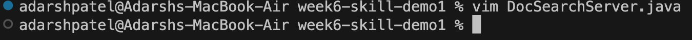

# Lab Report 4
## Part 1

In `DocSearchServer.java`, we changed the name of the `start` parameter of `getFiles`, and all of its uses, to be instead called `base`.

This was done in exactly 23 steps.

`/start<Enter>cgnbase<Esc>n.n.:wq<Enter>`

While in vim, first type `/start<Enter>` (7 keys) and you will get something like this below.

What is happening here is a search for the word `start`, since that is the word we are trying to replace. This is basically similar to using `Ctrl + F`. When typing `/start<Enter>`, the cursor will jump to the first letter of the first instance of `start`.

Then, type the letters `cgn` (3 keys) and you will get this below.

We know `gn` selects (highlights) the next match of `start` everytime we use it. It's `start` since that is what we searched for earlier using `/start`. Then, append `gn` to `c` creating `cgn`. `c` deletes the highlighted portion of what we highlight and enters insert mode. This is why the command `cgn` here will delete `start` and enter insert mode.

Now, type `base<Esc>` (5 keys) and see the output below.

Since `cgn` put us into insert mode, we type base, since we want to replace `start` with the word `base`. Pressing `<Esc>` will escape us out of insert mode and back to visual mode.

Then, we are going to press `n.` 2 times. (4 keys). 

The first `n.` takes you here:

The second `n.` takes you here:

The third `n.` takes you here, but this isn't part of the procedure since it's apart of a different method.:

I didn't tell you to do a 4th one but if you accidentally did or if you're confused on your own when you are done finding and replacing, if you do `n.` again, you get an an error telling you there is nothing left to find and replace.

What `n.` does each time in these screenshots is simple. `n` is simply go to the next time `start` exists in the file. If it doesn't exist, you get an error like you see on the 4th image of trying it. Appending the `.` repeats the last edit we did, which was doing the command `cgn`, typing `base` and then exiting insert mode. `.` performs all 3 of those actions in one and has now essentially created a find and replace method.

Next type `:wq<Enter>` (4 keys) and you will get the output below.

When you type `:wq`, it will show at the bottom left of the terminal where we have previously seen where insert mode, `n.`, `cgn`, and other commands show up. Hitting `<Enter>` will execute this command. `:wq` is a mix of 2 commands where `w` saves the file and `q` quits. Doing this command together, `:wq` will save the file and exit out of vim.

The total keys pressed was: 23.

## Part 2

Starting locally, the process took 46.03 seconds.
Starting remotely, the process took 34.29 seconds.

Some errors in testing was running bash on the server the first time took a little longer than the second time. If we took out actually running the bash file, the editing in vim would be much faster.

1. If I was running remotley, I would still use Visual Studio Code over vim. Having a mouse and access to Visual Studio Code's errors, colors, and other features is much more useful than speed in my opinion. Scping a whole directory can take a while, however, uplaoding to Github then cloning on the remote is a fine trade I'm willing to make. I think in this case, Visual Studio Code is more comfortable to use and comfort would be more important than speed here. 

2. The only time I see myself using vim is if the error is so small it isn't worth re-scping the file over to the remote from the local. If changes are small, vim can make searching and editing much more simpler. However, in the majority of cases, I still think Visual Studio Code would be a better option. A bigger project would be done better locally since one project can have multiple java files which would be much easier to see on Visual Studio Code. On vim, you can only see one at a time, unless you split your terminal, however, that can become clogged. 
