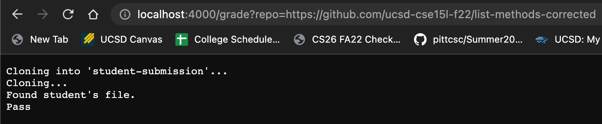
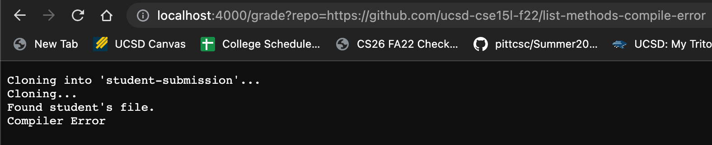
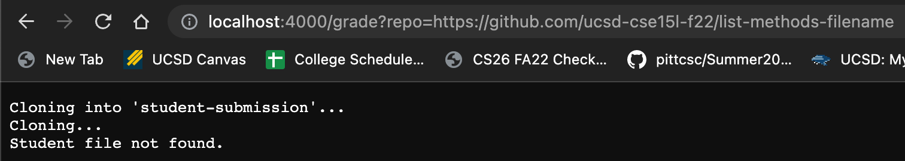
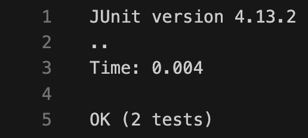

# Lab Report 5
Below is my grade.sh:

```bash
# Create your grading script here
rm -rf student-submission
git clone $1 student-submission

echo "Cloning..."

cd student-submission

if [ -f ListExamples.java ]
then
    echo "Found student's file."
else
    echo "Student file not found."
    exit
fi

cp ListExamples.java ..

cd ..

javac -cp .:lib/hamcrest-core-1.3.jar:lib/junit-4.13.2.jar *.java 2> err.txt

if [ $? -ne 0 ]
then
    echo "Compiler Error"
    exit
fi

java -cp .:lib/hamcrest-core-1.3.jar:lib/junit-4.13.2.jar org.junit.runner.JUnitCore TestListExamples > grade.txt

OK=$(grep -c OK grade.txt)

if [ $OK -eq 1 ]
then
    echo "Pass"
else
    echo "Fail"
fi

exit
```

Below are the outputs for three different repositories:

Repository 1: `https://github.com/ucsd-cse15l-f22/list-methods-corrected`



Repository 2: `https://github.com/ucsd-cse15l-f22/list-methods-compile-error`



Repository 3: `https://github.com/ucsd-cse15l-f22/list-methods-filename`



## Trace

The trace will be done for this Repository 1: `https://github.com/ucsd-cse15l-f22/list-methods-corrected` (Refer to the first image).

| Line Number | Commands | Standard Output | Standard Error | Exit Code |
|-------------|----------|-----------------|----------------|-----------|
| 2 | `rm -rf` | No Output | No Output | 0 |
| 3 | `git clone` | No Output | `Cloning into student-submission'...` | 0 |
| 5 | `echo` | `Cloning...` | No Output | 0 |
| 7 | `cd` | No Output | No Output | 0|
| 11 | `echo` | `Found student's file` | No Output | 0 |
| 17 | `cp` | No Output | No Output | 0 |
| 19 | `cd` | No Output | No Output | 0 |
| 21 | `javac` | No Output | No Output | 0 |
| 29 | `java` |  | No Output | 0 |
| 35 | `echo`| `Pass` | No Output | 0 |
| 40 | `exit` | No Output | No Output | 1 |

For the if statements:
On line 9, the if statement `-f ListExamples.java` is true since the file ListExamples.java exists in the working directory. (It came from cloning the repository). Since this is true lines 12 to 14 from `else` to `exit` do not run. The second if statement on line 23, `$? -ne 0` is false since this repository does not have a compiler error. Since `javac` ran successfully, the return code was 0. This means lines 24 to 26 do not run from `then` to `exit`. The third if statement on line 33, `$OK -eq 1`, is true since all test cases passed in the given repository. Remember OK holds the command `$(grep -c OK grade.txt)` (Look at line 31). We grepped the amount of times grade.txt (The file where we put `java`'s command output to) had the word `OK` in it. The command `grep -c` would return 1 and it also means all test cases passed. The if statement checks if that is 1. Because it is true, lines 36 to 37 do not run from `else` to `echo "Fail"`. 
