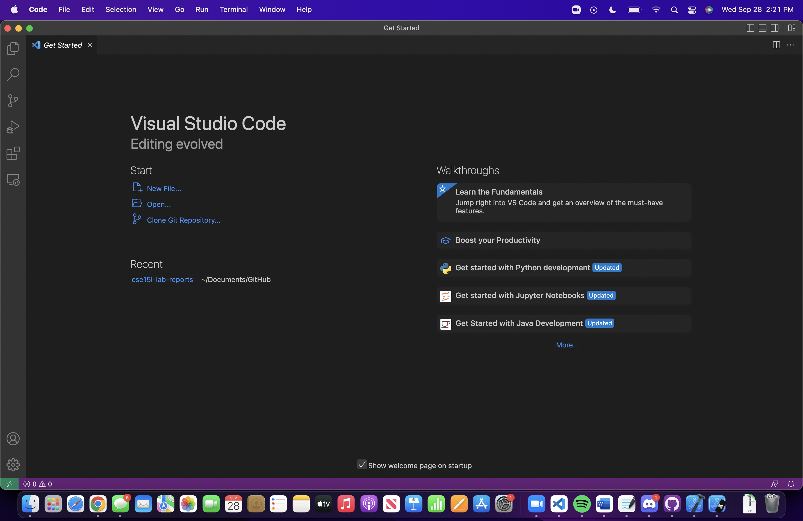
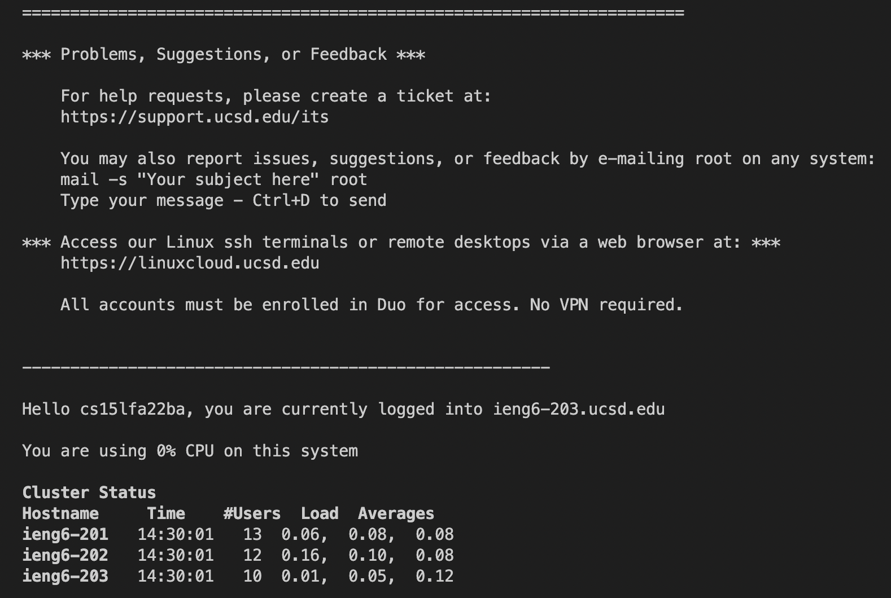
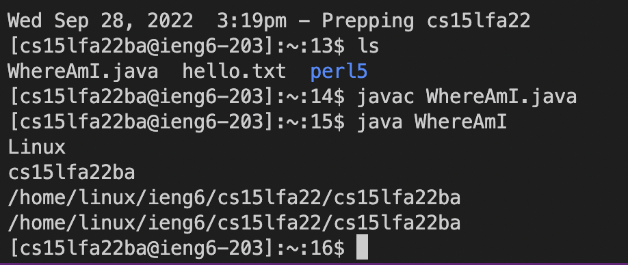
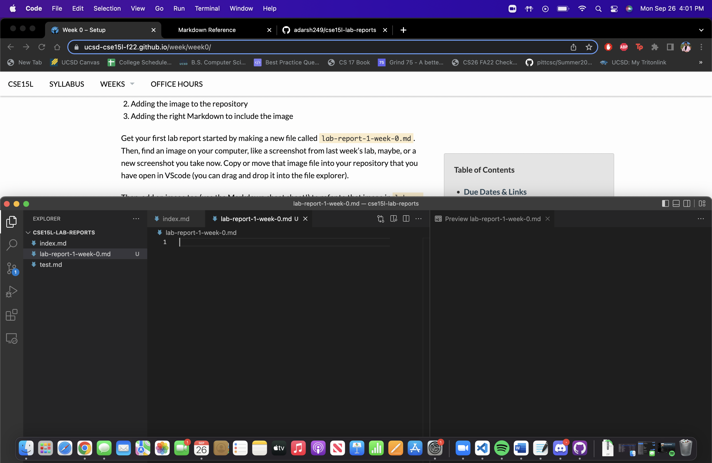
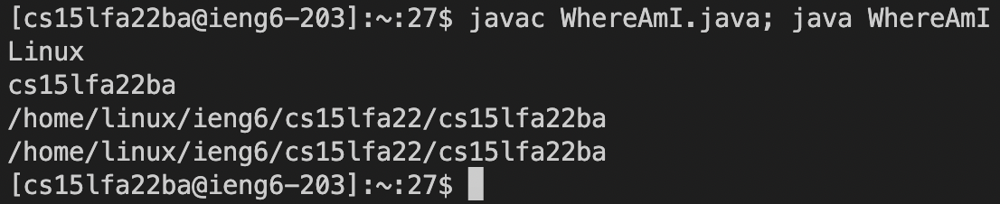

# Lab Report 1
## Step 1

Make sure to install Visual Studio Code. Go to this link: [VS Code Download](https://code.visualstudio.com/download) and download the correct
version based on your operating system. I already have VS Code downlaoded, however, after the download, install and open VS Code, and you'll have
something that looks like this below.

## Step 2

The next step is to remotley connect to our server. The first thing to do is install OpenSSH here: [Install OpenSSH](https://learn.microsoft.com/en-us/windows-server/administration/openssh/openssh_install_firstuse?tabs=gui) If you are running on Mac like me, theres no need to install OpenSSH and you can proceed. Open Visual Studio Code and type `ssh cs15lfa22ba@ieng6.ucsd.edu`. 
You will get a message since it is your first time connecting to the server so just type `Yes` and hit Enter. After some time, you will get a screen that looks like this below.

## Step 3

Next, try some commands. While logged into the ssh server try the command `cp /home/linux/ieng6/cs15lafa22/public/hello.txt ~/`, then right after print out the contents of hello.txt by entering the command `cat /home/linux/ieng6/cs15lfa22/public/hello.txt` After this, you will get something in your terminal that looks like this below.

## Step 4

Next you need to move files using the scp command. Create a file "WhereAmI.java" in Visual Studio Code and copy and paste the highlighted contents below into that file.
`class WhereamI{
  public static void main(String[] args){
    System.out.println(System.getProperty("os.name"));
    System.out.println(System.getProperty("user.name"));
    System.out.println(System.getProperty("user.home"));
    System.out.println(System.getProperty("user.dir"));
   }
  }`

After saving this file, run the command `scp WhereAmI.java cs15lfa22ba@ieng6.ucsd.edu` in your terminal. After typing your password, log in again as we did in Step 2 and type `ls` into the command line. If the file WhereAmI.java is present, type the commands 
`javac WhereAmI.java
java WhereAmI`
into the terminal.
 
You should have an output like the screenshot below.

 
## Step 5
 
Now you should set up an SSH key so you do not have to type the super long password everytime. In your terminal, first type `exit` into the terminal if you are not yet on your local computer. Then type `ssh-keygen` into the terminal. After the terminal is done printing everything, log into the client again like you normally would. After logging on, type the command `mkdir .ssh` into the terminal then type `exit` into the terminal to logout. Then back on the client type `scp /Users/adarshpatel/.ssh/id_rsa.pub cs15lfa22@ieng6.ucsd.edu:~/.ssh/authorized_keys`
After this, you are now able to ssh into the server using the passphrase created. You will have something like this in your terminal in the middle of the process and now when SSHing into the server.
 

 
## Step 6

The next step is to optimize remote running. Try the command `ssh cs15lfa22ba@ieng6.ucsd.edu "ls"`. You can run commands and log in at the same time! Another command to to try when logged in is `javac WhereAmI.java; java WhereAmI`. Below should be what your output should look like.

