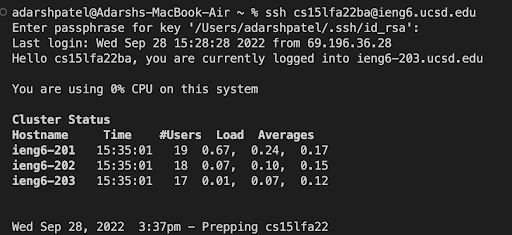

# Lab Report 1
## Step 1

Make sure to install Visual Studio Code. Go to this link: [VS Code Download](https://code.visualstudio.com/download) and download the correct
version based on your operating system. I already have VS Code downloaded, however, after the download, install and open VS Code, and you'll have
something that looks like this below.


## Step 2

The next step is to remotely connect to our server. The first thing to do is install OpenSSH here: [Install OpenSSH.](https://learn.microsoft.com/en-us/windows-server/administration/openssh/openssh_install_firstuse?tabs=gui) If you are running on Mac like me, theres no need to install OpenSSH and you can proceed. Open Visual Studio Code and type `ssh cs15lfa22ba@ieng6.ucsd.edu`. This command will use ssh to log us into the server. This will be the first step in logging into the server. You will get a message since it is your first time connecting to the server so just type `Yes` and hit Enter. After some time, you will get a screen that looks like this below.


You are now logged onto the server!

## Step 3

Next, try some commands. While logged into the ssh server try the command `cp /home/linux/ieng6/cs15lafa22/public/hello.txt ~/`. This command will copy the `hello.txt` file from the path you entered and put it your server's home directory. Then right after print out the contents of hello.txt by using the `cat` command by entering the command `cat /home/linux/ieng6/cs15lfa22/public/hello.txt` After this, you will get something in your terminal that looks like this below.


## Step 4

Next you need to move files using the scp command. Create a file "WhereAmI.java" in Visual Studio Code and copy and paste the highlighted contents below into that file.
```
class WhereAmI{
  public static void main(String[] args){
    System.out.println(System.getProperty("os.name"));
    System.out.println(System.getProperty("user.name"));
    System.out.println(System.getProperty("user.home"));
    System.out.println(System.getProperty("user.dir"));
   }
  }
```

After saving this file, run the command `scp WhereAmI.java cs15lfa22ba@ieng6.ucsd.edu:~/` in your terminal. It is important to make sure you are first on the local computer and not on your server. How this command works is `scp` will secure copy the file `WhereAmI.java`. `cs15lfa22ba@ieng6.ucsd.edu` is the normal login we use to get into the ssh server. The `:~/` tells us where we should put the file in the server. Anything after the `:` means the server, so in this case we are putting `WhereAmI.java` from the local computer to the home directory(because of the `~`) in the server. It will prompt you for your password so make sure to type that in. Then, log in again as we did in Step 2 and type `ls` into the command line. `ls` allows us to see which files exist in the current directory. If the file `WhereAmI.java` is present, type the commands 
`javac WhereAmI.java` and  `java WhereAmI`
into the terminal. These are your basic commands to execute and run the java file.
 
You should have an output like the screenshot below.

 
## Step 5
 
Now you should set up an SSH key so you do not have to type the super long password everytime. In your terminal, first type `exit` into the terminal if you are not yet on your local computer.`exit` will log you out if you are currently on the server and take you back to your local computer. Then type `ssh-keygen` into the terminal. This command is going to create a pair of files with a public key and a private key. Hit enter when you get the message `Enter file in which to save the key (/Users/adarshpatel/.ssh/id_rsa):` You will then be prompted to make and re-enter a passcode, so make something shorter than you had before. After the terminal is done printing everything, log into the client again like you normally would (Refer to step 2). After logging on, type the command `mkdir .ssh`, which will create a directory with the name `.ssh`into the terminal then type `exit` into the terminal to logout. Then back on the client type `scp /Users/adarshpatel/.ssh/id_rsa.pub cs15lfa22@ieng6.ucsd.edu:~/.ssh/authorized_keys`. Just like Step 4, this will securely copy the public key to the `.ssh\id_rsa.pub` path in the server. 
After this, you are now able to ssh into the server using the passphrase created. You will have something like this in your terminal when SSHing into the server.
 

 
## Step 6

The next step is to optimize remote running. Try the command `ssh cs15lfa22ba@ieng6.ucsd.edu "ls"`. You can run command `ls` to see what files are on the server and log in at the same time! Another command to to try when logged in is `javac WhereAmI.java; java WhereAmI`. This will compile and execute `WhereAmI.java` in one line when you are on the server or local! Check the screenshot below of what it should look like.


